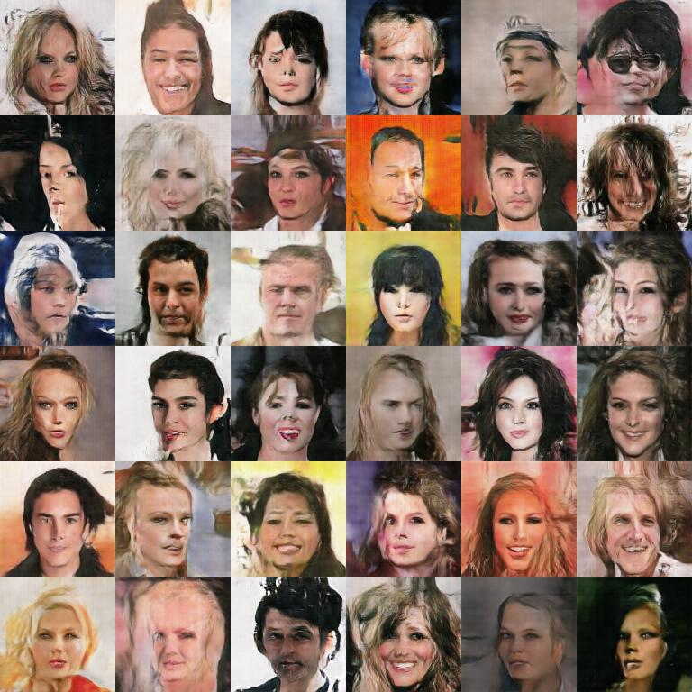

# ogan-pytorch

A pytorch implementation for OGAN [《Orthogonal Generative Adversarial Network》](https://arxiv.org/abs/1903.01931)

## Example

After 3 epochs (update...):

### Generation

### Reconstruction

