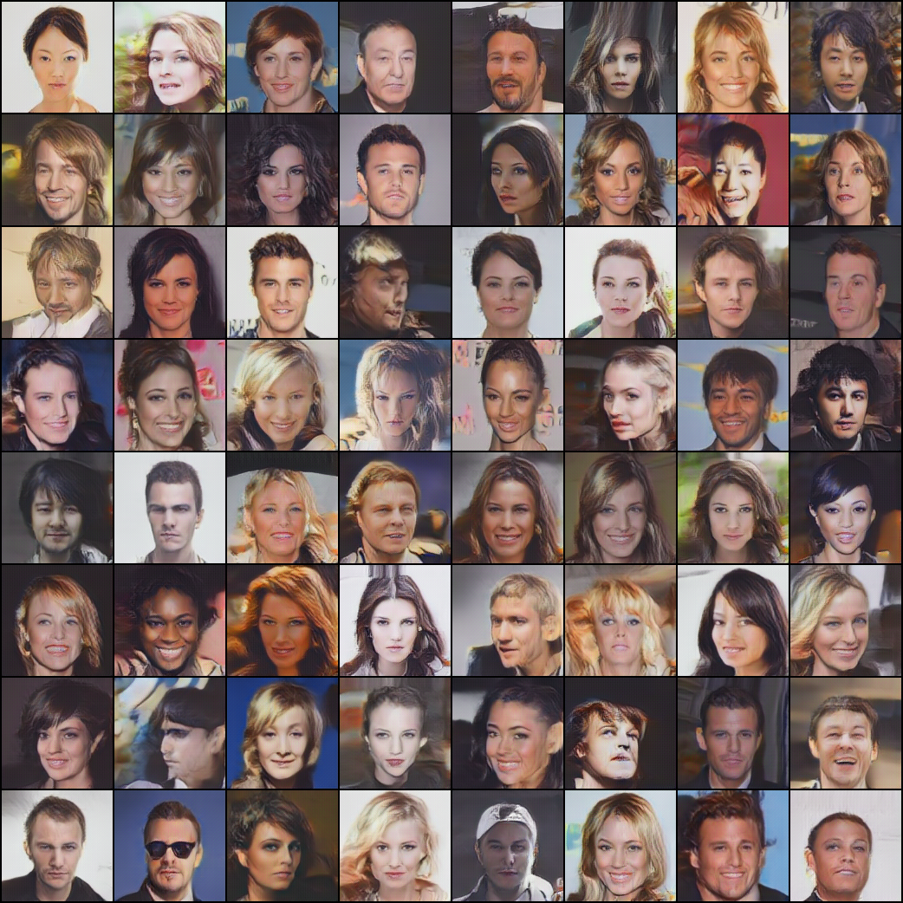

# ogan-pytorch

A pytorch implementation for OGAN [《Orthogonal Generative Adversarial Network》](https://arxiv.org/abs/1903.01931)

## Usage

### Training

```shell script
python train.py --dataset_path <img_dir> --batch_size 16 --epochs 50
```

The checkpoints will be saved in dir `checkpoints`, and the sample images in dir `output` while training.

### Generation

Replace the default checkpoints path in `gen_imgs.py`, and run:

```shell script
python gen_imgs.py 
```

## Example

Using celeba dataset, after 3 epochs (About 2 hours):

### Generation




